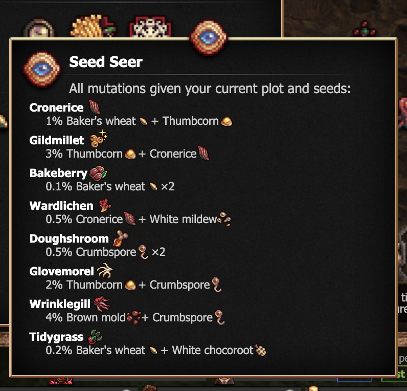
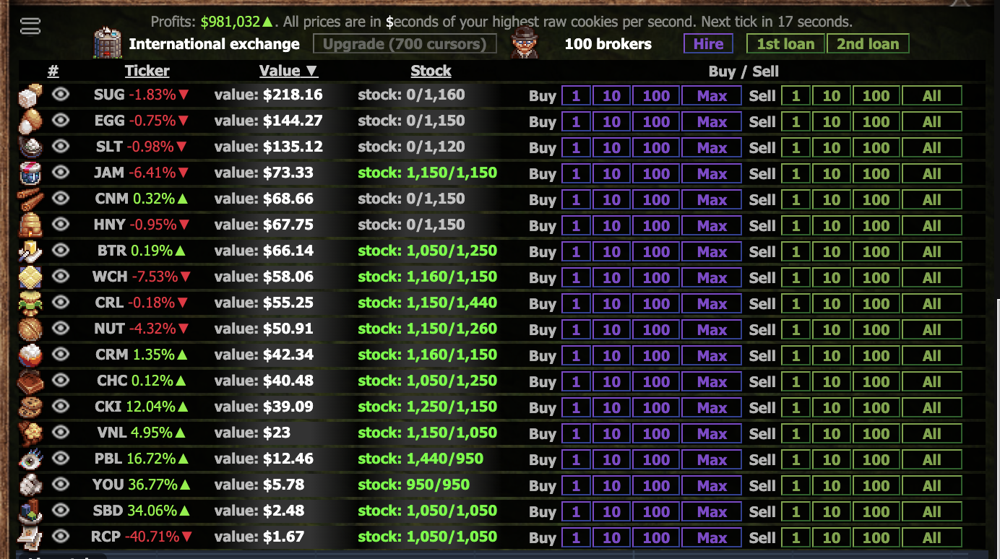

# Soggy Cookies

A loose collection of cookie clicker mods. 

# To install
as a bookmarklet: 
```js
javascript:(function() {Game.LoadMod('https://adenine-dev.github.io/soggy_cookies/%NAME_OF_MOD_HERE%.js');}());
```

with [CCMM](https://github.com/klattmose/CookieClickerModManager): 
```
https://adenine-dev.github.io/soggy_cookies/%NAME_OF_MOD_HERE%.js
```

# Mods

## [Commander](./commander.js)
Swaps ctrl hotkeys to be cmd hotkeys on macos.

> **Note**
>
> Does not disable ctrl hotkeys (for compatibility reasons) or change the text (for localization and laziness reasons).


## [Seed Seer](./seed_seer.js)
Provides a tool that shows all available garden mutations. 



> **Note**
> 
> This tool is only unlocked if you have the "seedless to nay" achievement.

## [Stonksheet](./stonksheet.js)
Provides an alternate view into the stockmarket, with extended functionality and a smaller vertical footprint.



## [Buff Buffs](./buff_buffs.js)
Modifies the buff tooltips to show how long the buff has remaining.

## [Lump Vaticinator](./lump_vaticinator.js)
Modifies the lump tooltip to tell you what type it is in the lump's infancy.

> **Warning**
> 
> This may be considered cheating to some as it gives information you would otherwise not have access to.

## [Golden Hand](./golden_hand.js)
Clicks many things automatically. Namely the fortunes, reindeer, golden cookies, and wrath cookies.

> **Warning**
> 
> This may be considered cheating as it automates part of the game that would otherwise be manual.

# Note on translation
All of these mods only work in english, if you are interested in translating any of them into another language please reach out.